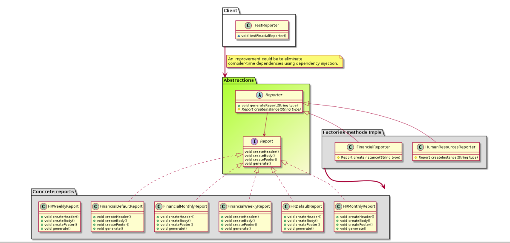

# Factories

Beside the fact that factories encapsulates the creation of objects, I'm particularly interested in to understand how to achieve **dependency inversion** using them. 
The next documentation is focused in this aspect of factories.

## SimplebFactory
Not concidered a pattern by itself but still useful to understand the whole picture. 

**Motivation**
Encapsulate objects creation.

**Drawback**
The client class still maintain transitive dependencies with concrete classes.

## Factory Method

**Motivation**
- Encapsulate objects creation.
- To partialy achive dependency inversion 

**Particularity**
Use of inheritance.

At some point I realized that we can fully achieve dependency inversion principle just using dependency injection.

## AbstractFactory

From GofF
AbsractFactory: "AbstractFactory only declares an interface for creating products. 
It's up to ConcreteProduct subclasses to actually create them. 
The most common way to do this is to define a factory method (see Factory Method (107)) for each product. 
A concrete factory will specify its products by overriding the factory method for each"

Factory method: "Parameterized factory methods. Another variation on the pattern lets the factory method create multiple kinds of products. 
The factory method takes a parameter that identifies the kind of object to create."

It's clear to me than both patterns are very close related, the guidelines provided in the GoF are quite ambiguous and contradictories. I think the idea requires some revision.

**Motivation**
- Encapsulate objects creation.
- To achive dependency inversion.

**Particularity**
Use of composition.

**Drawback**
Change the interface is required if some new object type need to be created.
