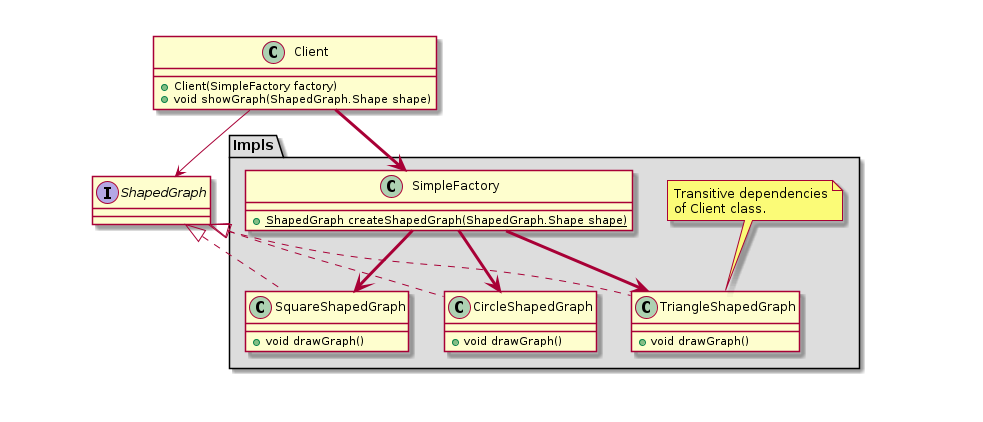
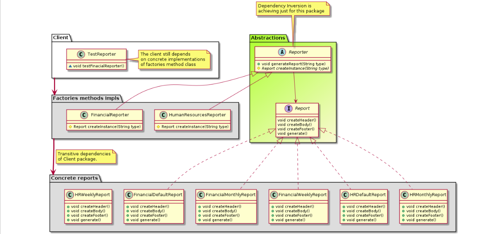

# Factories

## SimplebFactory
Not concidered a pattern by itself but still useful to understand the whole picture. 

**Motivation**
Encapsulate objects creation.

**Drawback**
The client class still maintain transitive dependencies with concrete classes.

## Factory Method

**Motivation**
- Encapsulate objects creation.
- To partialy achive dependency inversion 

**Particularity**
Use of inheritance.

## AbstractFactory

**Motivation**
- Encapsulate objects creation.
- To achive dependency inversion.

**Particularity**
Use of composition.

**Drawback**
Change the interface is required if some new object type need to be created.
